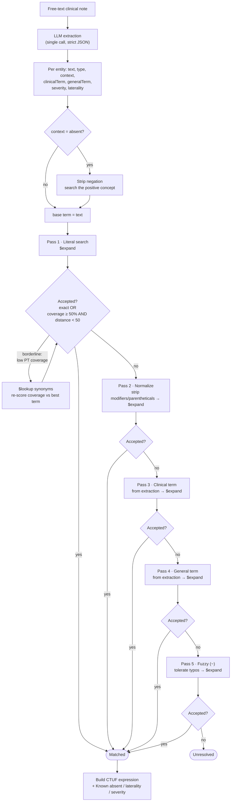

# Clinical Entity Extraction with LLM Chains and SNOMED CT Binding

*A technical note on the "Entity extraction" demo in the SNOMED CT · Applications in AI application.*

## Abstract

We describe the clinical entity–extraction pipeline used in this demo. Free-text
clinical notes are parsed by a large language model (LLM) into structured
entities, and each entity is bound to a SNOMED CT concept through a deterministic,
escalating cascade of terminology-server queries. The design favours **precision
and transparency** over recall: a token-coverage confidence guardrail rejects
lexically unrelated matches, a synonym-aware re-scoring step recovers matches that
the server returns under a non-preferred term, and every decision is recorded in a
per-entity execution trace that the user can inspect. Crucially, the semantic
reformulations needed for matching (spelling correction, lay→clinical mapping,
generalization) are produced **inline in the single extraction call**, so the
matching cascade adds **no extra LLM round-trips**. This note documents the
pipeline, its decision rules, and its limitations. It is a simplified
re-implementation of the algorithm in
[IHTSDO/llm-chain-entity-extraction](https://github.com/IHTSDO/llm-chain-entity-extraction).

## 1. Overview

The pipeline has two stages:

1. **Extraction** — one LLM call turns the note into a list of entities with
   structured attributes (Structured Outputs / strict JSON schema).
2. **Terminology binding** — for each entity, an ordered cascade of Snowstorm
   (FHIR) queries attempts to resolve a SNOMED CT concept, gated by a confidence
   guardrail.

Model: **`gpt-5-mini`** (via the OpenAI Chat Completions API, called directly from
the browser). Terminology server: **Snowstorm Lite**
(`implementation-demo.snomedtools.org`), queried over FHIR
`ValueSet/$expand` and `CodeSystem/$lookup`.

## 2. Extraction

A single call with a strict JSON schema returns, for every detected term:

| Field | Purpose |
| --- | --- |
| `text` | The **verbatim** substring from the note (used for highlighting and the literal search). |
| `type` | `finding` \| `procedure` \| `medication` \| `morphology` \| `body structure`. |
| `context` | `present` \| `absent` \| `unknown` (negation). |
| `fsn`, `singularFsn` | Fully specified name and its de-pluralized form. |
| `clinicalTerm` | The **standard, positive** clinical term (lay→clinical mapping, spelling corrected). e.g. *"low platelet count" → "thrombocytopenia"*. |
| `generalTerm` | A **broader** form dropping specific qualifiers. e.g. *"bilateral pelvic masses" → "mass"*. |
| `severity`, `laterality` | Modifiers, when present. |

`clinicalTerm` and `generalTerm` are the key to keeping the matching cascade free
of extra LLM calls: the semantic reformulations are computed **once**, with full
note context, at extraction time.

## 3. Terminology binding: the matching cascade

For each entity, the system searches SNOMED CT with progressively "smarter" query
terms and stops as soon as a candidate passes the confidence guardrail (§4). Each
search is a FHIR `$expand` constrained by an ECL hierarchy chosen from the entity
type (`finding`/`morphology` → `<< 404684003 |Clinical finding|`, `procedure` →
`<< 71388002 |Procedure|`, etc.).



The passes, in order:

1. **Literal** — the verbatim `text` (negation-stripped when `context = absent`).
2. **Normalize** — `text` with laterality/severity words and parenthetical
   qualifiers/semantic tags removed. Skipped when there is nothing to strip.
3. **Clinical term** — the LLM's `clinicalTerm` (semantic reformulation).
4. **General term** — the LLM's `generalTerm` (broader concept).
5. **Fuzzy** — Snowstorm's `~` operator, to absorb spelling variants and typos.

Candidates within a page are ranked by our own criteria — **exact match →
token coverage → edit distance** — rather than trusting the server's order (which
Snowstorm Lite mis-ranks for broad terms).

## 4. Confidence guardrail

A candidate is accepted only if it is an **exact** normalized match, **or** it has
sufficient **query-token coverage** *and* a sane **edit distance**:

```
accept ⇔ exact
       ∨ ( coverage ≥ 0.50  ∧  Levenshtein(queryTerm, candidate) < 50 )
```

*Coverage* is the fraction of the query's content tokens (lower-cased, stop-words
removed, lightly stemmed) that appear in the candidate. This is what rejects
lexically unrelated server noise — e.g. *"computed tomography"* must not bind to
*"CT ovary"* (coverage 0), and *"latent tuberculosis infection"* is not accepted
for *"Inactive tuberculosis"* on the preferred term alone (coverage ≈ 33%).

## 5. Synonym-aware coverage

The server returns each concept's **preferred term (PT)**, but the match may have
been on a **synonym**. When the top candidate is close (`distance < 50`) but its PT
coverage is below threshold, the system issues one `CodeSystem/$lookup` for that
concept, retrieves **all** its terms (PT + designations/synonyms), and re-scores
coverage against the best-matching term. A synonym can therefore rescue a correct
concept whose PT reads differently (recorded in the trace as *"via synonym: …"*).
The `$lookup` is **conditional** and bounded to at most one call per failed pass.

## 6. Negation handling

When the extractor marks an entity `context = absent`, the search uses the
**positive** concept (negation cues such as *no, not, without, denies, no evidence
of* are stripped): *"no fever" → search "fever"*. The negation itself is preserved
and, for findings, encoded in the postcoordinated expression as
`408729009 |Finding context| = 410516002 |Known absent|`. The demo only resolves
the positive code; how a downstream system consumes the negation is out of scope.

## 7. Postcoordinated expression (CTUF)

For a matched entity the system assembles a compositional (CTUF-style) expression,
appending refinements when present: **finding context** (negation), **laterality**
(`272741003`), and **severity** (`246112005`).

## 8. Observability: the flow trace

Every entity carries an ordered execution trace, rendered as a colour-coded flow
diagram in the UI. Each step is tagged by its **source** — **LLM** (extraction,
clinical/general term), **Snowstorm** (`$expand`, `$lookup`), or **local**
(deterministic normalization and scoring) — and search steps show the candidate
table with **code, display, edit distance and coverage**, the chosen row, and any
synonym used. This makes it explicit *why* an entity did or did not resolve.

## 9. Limitations and future work

- **Lexical guardrail.** Token coverage cannot judge semantic equivalence when
  wording differs substantially. The intended remedy is a batched LLM
  disambiguation/judge pass (one call per note) over borderline candidates.
- **Server ranking.** Snowstorm Lite applies the result limit before relevance
  sorting, so broad terms can bury the exact concept; our own candidate ranking
  mitigates but does not fully solve this.
- **Acceptance threshold.** The Levenshtein bound (`< 50`) is deliberately loose;
  the coverage guardrail does most of the precision work and could be tightened
  with evaluation data.
- **No evaluation set.** There is no gold-standard benchmark wired in yet; adding
  one would let us tune thresholds against measured precision/recall.

## References

1. SNOMED International. *IHTSDO/llm-chain-entity-extraction.*
   <https://github.com/IHTSDO/llm-chain-entity-extraction>
2. *AI Chains ePoster*, SNOMED Expo 2023 (see `assets/AI-Chains-ePoster-Expo-2023.pdf`).
3. HL7 FHIR Terminology Service — `ValueSet/$expand`, `CodeSystem/$lookup`.
4. SNOMED CT Expression Constraint Language (ECL).
